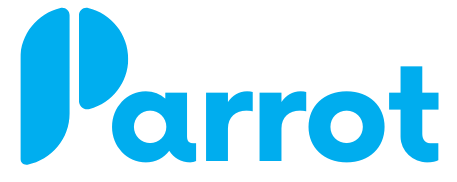

  

# Parrot Project Management

Parrot is a collaborative project management suite founded by a team of four individuals. It empowers teams to effectively ideate, develop, and execute complex projects by utilizing AI-generated project plans, interactive data visualizations, and automated reporting. The inclusion of Gantt charts within Parrot facilitates seamless project scheduling, resource allocation, progress tracking, and communication among team members.

-----------------

## Founders
<!-- HTML STARTS HERE -->

  <!-- First team member -->
  

    
Christopher Banas

    

      
      
    

  

  <!-- Second team member -->
  

    
Michael Bird

    

      
      
    

  

  <!-- Third team member -->
  

    
Roderick Mendoza

    

      
      
    

  

  <!-- Fourth team member -->
  

    
Ryder Aguilera

    

      
      
    

  

<!-- HTML ENDS HERE -->

-----------------

## Technologies

### User Auth

For user authentication, Parrot utilizes [JWT](https://jwt.io/) (JSON Web Token) authentication with the help of essential dependencies. We leverage the [passport](https://www.passportjs.org/) library, utilizing the LocalStrategy for authentication. User passwords are securely hashed using [bcryptjs](https://www.npmjs.com/package/bcryptjs), and the User model from [mongoose](https://mongoosejs.com/) is employed to interact with the database and manage user authentication processes. This setup ensures a secure and reliable authentication system for our application.

### Front End

Our frontend is built on the [Node.js](https://nodejs.org/en/about) runtime environment and utilizes [Webpack](https://webpack.js.org/) for module bundling, along with [React](https://react.dev/) and [Redux](https://redux.js.org/) for building a dynamic and interactive user interface.

### Back End
Our backend is built on the combination of [MongoDB](https://www.mongodb.com/) and [Express.js](https://expressjs.com/). MongoDB, a NoSQL database, allows for flexible and scalable data storage, while Express.js provides a streamlined and efficient framework for building web applications. With this stack, we leverage the benefits of a versatile database and a lightweight yet feature-rich backend framework, enabling us to develop a highly performant and scalable backend system for our project.

### Hosting / Domain

* Heroku
* Redis
* Google Domains

-----------------

## UX / UI Design

Our UX/UI design is characterized by a minimalist style and carefully selected colors, creating a clean and visually pleasing interface. By embracing simplicity and decluttering, we prioritize essential elements, enhancing user focus and intuitiveness. The chosen color palette complements the overall design, evoking a sense of harmony and reinforcing the app's visual identity. This design approach fosters an enjoyable and streamlined user experience, promoting ease of use and efficient interaction with the application.

Our logo is a testament to our brand's uniqueness, as it was custom designed by Christopher Banas. The logo features a distinctive A shape that cleverly incorporates a subtle resemblance to a bird or parrot.

-----------------

## Features

- **Signup:** Users can sign up for Parrot by providing their name, email, and a password

- **Logout:** Users can logout of their account at any time, which will immediately end their session and ensure that their data is secure.

- **Projects:** Users can create new projects within the application, enabling them to organize and manage their initiatives effectively. Each project can be customized with relevant details, such as descriptions, deadlines, and assigned team members. This feature provides a streamlined platform for users to collaborate, track progress, and ensure the successful execution of their projects.

- **Tasks:** Users have the ability to create and manage tasks within the application, allowing for efficient organization and execution of project activities. Each task can be assigned to specific team members, set with deadlines, and categorized with relevant details. This feature empowers users to track progress, delegate responsibilities, and ensure the timely completion of project tasks, enhancing overall project productivity and success.

- **Notifications:** Parrot incorporates a notification system that keeps users informed about important updates and activities. Users receive real-time notifications for project-related events, such as task assignments, task completions, and project milestones. This feature ensures that users stay up-to-date with project progress and fosters efficient communication and collaboration within the team.

-----------------

## OpenAi

Parrot integrates [OpenAI's API](https://openai.com/product) and utilizes Chat GPT to automate task generation based on the project's name and description. By leveraging the capabilities of Chat GPT, accurate and relevant tasks are automatically generated, providing teams with an efficient and streamlined workflow. Experience the power of artificial intelligence in project management by leveraging our innovative solution.

## Gantt Chart

A Gantt chart is a visual tool that displays project tasks as horizontal bars on a timeline, enabling efficient project planning, tracking, resource allocation, bottleneck identification, and progress monitoring in project management apps.

We Implemented an intuitive user experience for the Gantt chart visualization in Parrot by leveraging the capabilities of npm packages such as [moment](https://momentjs.com/) for time manipulation, [snapsvg](http://snapsvg.io/) for interactive SVG rendering, [frappe-gantt](https://frappe.io/) for Gantt chart functionality, and [sass](https://sass-lang.com/) for seamless and maintainable styling.

By integrating the Gantt chart with the application's state, this enabled real-time updates and synchronization with the project data.

## Websocket Live Notifications

This MERN stack project showcases the seamless integration of websockets to enable live notifications for project and task CRUD operations. By utilizing websockets, users receive real-time notifications whenever a project or task is created, updated, or deleted. This dynamic feature enhances collaboration and keeps team members informed about the latest changes, ensuring a synchronized and efficient project management experience.

-----------------

## Wiki

Want to take a deeper dive into this project? Check the articles from the [wiki](https://github.com/Team-Parrot-Project/Parrot/wiki).

-----------------
© Parrot
